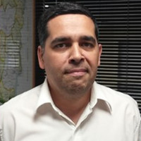

# Ciberseguridad Industrial en la Distribución de Electricidad

## Descripción  
  La Tercera Revolución Industrial inició con la aparición del controlador lógico programable. La Primera nació del uso de vapor de agua y la Segunda surgió desde el combustible líquido derivado del petróleo; en la Tercera se funden inteligencia, ciencia y tecnología. La mecánica dio paso a la electrificación masiva, los cambios culturales y sociales abrieron el camino a la Sociedad del Conocimiento.  
  El uso de sistemas ciber-físicos está pariendo la “Industria 4.0” o ciber-industria, con muchos beneficios, aunque también con riesgos asociados y consecuencias. La distribución de electricidad constituye una etapa sensible, en la que resulta clave su disponibilidad.  
  Canales inseguros por definición, protocolos obsoletos, ausencia de controles, accesos no autorizados y protección de infraestructuras críticas son algunos de los temas a exponer.

## Speaker
| Walter Heffel						|			|
|---------:						|---								|
|Paraná, Entre Ríos					|								|
|Twitter:						|[@heffelw](https://twitter.com/heffelw)			|
|LinkedIn:						|[walterheffel](https://ar.linkedin.com/in/walterheffel)	|

## Link  
* [GitHub](https://github.com/ParanaConf/2018.presentations/raw/master/Ciberseguridad%20Industrial%20en%20la%20Distribuci%C3%B3n%20de%20Electricidad/IUA-FI-ESI-TFI-Heffel-Walter-ParanaConf1.pdf)
