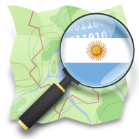
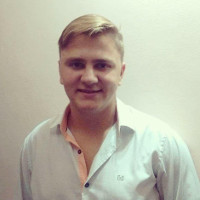

# Creando mapas colaborativos libres

## Descripción  
<table>
<tr>
<td>
<strong>OpenStreetMap</strong> es una plataforma libre donde diferentes usuarios pueden cargar información geográfica de todo el mundo y así crear una base de datos muy compleja y detallada. En esta charla se muestra en profundidad que es OSM y cómo se trabaja en la comunidad Latinoamericana y Argentina, así como varios ejemplos de utilización y de eventos que se realizan en torno al proyecto.
</td>
<td>
<a href="http://osmargentina.org/" target="_blank"> OSM Argentina</a>
</td>
</tr>
</table>

## Speaker
| Juan Blas Tschoop					|			|
|---------:						|---								|
|Lopez, Santa Fé					|								|
|Twitter:						|[@jbtschopp](https://twitter.com/jbtschopp)			|
|Telegram:						|[@jbtschopp](https://t.me/jbtschopp)				|
|Facebook:						|[juanblas09](https://www.facebook.com/juanblas09)		|

## Link  
Puedes ver la presentación de forma online en [http://slides.com/juanblas09/deck](http://slides.com/juanblas09/deck)
