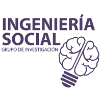
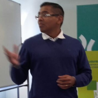

# Hardening anti-ransomware...una mirada no técnica

## Descripción  
<table>
<tr>
<td>

Se explican cuáles son las técnicas de ingeniería social utilizadas para lograr que el receptor abra un adjunto o un sitio web. También se mencionarán, a modo general, las posibles formas de infección con ransomware y se dará énfasis en la importancia de la educación y concientización sobre el tema en cuestión.

Objetivos:
<ul>
<li>Informar los puntos de entrada del Ransomware.</li>
<li>Mostrar ejemplos de ataques de ingeniería social y Ransomware.</li>
<li>Brindar consejos sobre cómo implementar un plan de concientización.</li>
</ul>
</td>
<td>
<a href="http://www.ingenieriasocial.com.ar/" target="_blank"> Ingeniería Social</a>
</td>
</tr>
</table>

## Speaker
| Mauro Gioino						|			|
|---------:						|---								|
|La Plata, Buenos Aires					|								|
|Twitter:						|[@maurog114](https://twitter.com/maurog114)			|
|LinkedIn:						|[mgioino](https://www.linkedin.com/in/mgioino/)		|
|E-Mail:						|[maurogioino@gmail.com](mailto:maurogioino@gmail.com)		|

## Link  
  * [GitHub](https://github.com/ParanaConf/2018.presentations/raw/master/Hardening%20anti-ransomware...una%20mirada%20no%20t%C3%A9cnica/ParanaConf%202018%20-%20Ing.%20Social%20%26%20RW.pdf)
