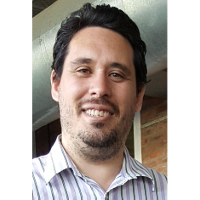

# Laboratorios de Seguridad Informática: La Práctica hace al Maestro

## Descripción  
  En ésta charla se explica de forma general que es una Prueba de Penetración, como se lleva adelante, para que nos sirve crear un laboratorio de seguridad, su planificación y construcción básica.

## Speaker
| Ruben Dario Aybar					|			|
|---------:						|---								|
|Quilmes, Buenos Aires					|								|
|Twitter:						|[@raybar18](https://twitter.com/raybar18)			|
|LinkedIn:						|[raybar18](https://www.linkedin.com/in/raybar18/)		|
|E-Mail:						|[r4yb4r@gmail.com](mailto:r4yb4r@gmail.com)			|

## Link  
 * [GitHub](https://github.com/ParanaConf/2018.presentations/raw/master/Laboratorios%20de%20Seguridad%20Inform%C3%A1tica:%20La%20Pr%C3%A1ctica%20hace%20al%20Maestro/ParanaConf_2018-Laboratorios%20de%20Seguridad%20Inform%C3%A1tica%20La%20Pr%C3%A1ctica%20hace%20al%20Maestro.pptx)
