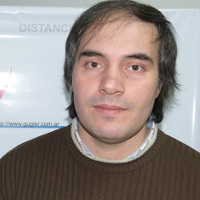

# Presentación EMA Libre

## Descripción  
<table>
<tr>
<td>

EMA Libre es un proyecto del <a href="http://www.gugler.com.ar" target="_blank">Laboratorio GUGLER</a> que pretende generar una alternativa libre para el control y gestión de estaciones meteorológicas y los datos que estas generan. En esta charla se hace una introducción al proyecto y su funcionamiento.
</td>
<td>

</td>
</tr>
</table>

## Speakers
| Exequiel Aramburu					|		|
|---------:						|---								|
|Paraná, Entre Ríos					|								|
|E-Mail:						|[exequiel@gugler.com.ar](mailto:exequiel@gugler.com.ar)	|
|Website:						|[http://www.gugler.com.ar](http://www.gugler.com.ar)		|

| Martín Sbarbaro					|			|
|---------:						|---								|
|Paraná, Entre Ríos					|								|
|E-Mail:						|[martin@gugler.com.ar](mailto:martin@gugler.com.ar)	|
|Website:						|[http://www.gugler.com.ar](http://www.gugler.com.ar)		|

## Link  
 * [GitHub](https://github.com/ParanaConf/2018.presentations/raw/master/Presentaci%C3%B3n%20EMA%20Libre/Ema_Presentacion.pdf)
 * [Gugler](https://campusvirtual.gugler.com.ar/course/view.php?id=41). *Acceder como invitado*
