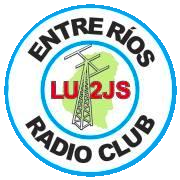

# Radioafición en el nuevo milenio

## Descripción  
<table>
<tr>
<td>

En la presentación se trata de redescubrir a la radioaficion, partiendo desde sus orígenes hace más de 100 años en la cual se utilizaba el código morse, el perfeccionamiento de la misma desde la incorporación de la comunicación por voz y hasta la incorporación de los medios digitales en este modo de comunicación.

Así mismo se verá la simbiosis entre el avance tecnológico e informático y la evolución de la radio, los receptores y trasmisores y amplificadores sus antenas, hasta llegar al actual auge de los SDR.

Se finaliza la presentación con la introducción a los medios digitales de señal muy débil (weak signal) que con señales por debajo de los niveles de ruido y con muy baja potencia de emisión permiten comunicaciones a muy larga distancia (intercontinentales) cuando resulta imposible realizarlos de otras formas y o con mucha potencia de emisión; como así también la presentación de nuevos paradigmas de antenas destinadas a estas forma de emisión y aplicadas a propagación esotérica.

</td>
<td>
 Entre Ríos Radio Club (LU2JS)</a>
</td>
</tr>
</table>

## Speaker
| Nacho Beber						|			|
|---------:						|---								|
|Paraná, Entre Ríos					|								|
|E-Mail:						|[lu5jib@gmail.com](mailto:lu5jib@gmail.com)			|

## Link  
  * [GitHub](https://github.com/ParanaConf/2018.presentations/raw/master/Radioaficion%20en%20el%20nuevo%20milenio/Weak%20Signal%20Communications.pptx)
